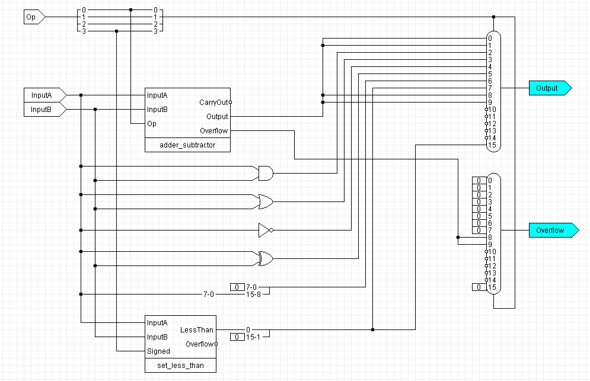
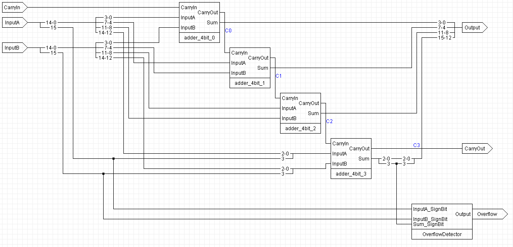
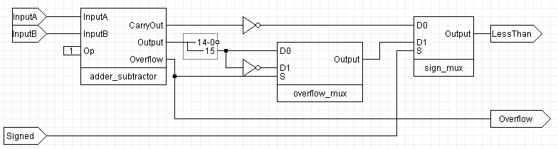

# Engineering
Collection of digital circuit projects using JLS, including building up to an ALU.

# ALU
[ALU](https://github.com/GammaWyvern/Engineering/tree/main/alu) includes an ALU built from the ground up in JLS.
It holds most of my circuit work collected together. Below are image examples of some of my sub-circuits in the ALU.

# Main ALU circuit:

---
# 16-bit Carry  Select Adder circuit:

---
# Set Less Than circuit:

---
